# LendSwift — Multi-Step Loan Application

<p align="center">
  <strong>A production-style, responsive multi-step loan application experience built with React.</strong>
</p>

<p align="center">
  <a href="#-features">Features</a> •
  <a href="#-application-flow">Application Flow</a> •
  <a href="#-tech-stack">Tech Stack</a> •
  <a href="#-getting-started">Getting Started</a> •
  <a href="#-testing">Testing</a> •
  <a href="#-project-structure">Project Structure</a>
</p>

---

## 📌 Overview

**LendSwift** is a frontend-focused digital lending application that guides applicants through a structured loan journey instead of forcing them through one large form.

The application supports **Personal, Home, and Business loans**, with conditional fields, step-level validation, KYC verification simulation, financial calculations, document handling, electronic signatures, draft persistence, and a final review/submission experience.

The project is based on a production-grade frontend engineering brief that calls for an **8+ step workflow, 50+ form fields, conditional rendering, cross-step dependencies, document upload, e-signature capture, auto-save/resume, pre-approval calculations, accessibility, responsive behavior, and E2E testing**.

> **Note:** This repository is a frontend simulation. It does not perform real PAN/Aadhaar verification, credit-bureau checks, loan disbursement, or backend document processing.

---

## ✨ Highlights

| Capability | Implementation |
|---|---|
| 🏦 Loan products | Personal, Home, Business |
| 🧭 Wizard workflow | 9 application stages with conditional navigation |
| ✅ Validation | React Hook Form + Zod schemas |
| 🔐 KYC simulation | PAN + Aadhaar validation/verification flow |
| 🏠 Address flow | PIN/state/city handling and address dependencies |
| 💼 Employment | Conditional employment-specific forms |
| 👥 Co-applicant | Appears according to loan type/amount rules |
| 💰 Financial analysis | EMI, affordability and eligibility calculations |
| 📄 Documents | Conditional document requirements, preview and upload flow |
| ✍️ E-signature | Responsive signature-pad experience |
| 💾 Drafts | Save/resume workflow using browser storage |
| 🧮 Indian currency | INR formatting and loan calculations |
| ♿ Accessibility | Semantic labels, ARIA support and keyboard-friendly controls |
| 📱 Responsive UI | Designed for mobile through desktop layouts |
| 🧪 Automated testing | Vitest + Playwright E2E coverage |

---

## 🖥️ Screenshots

> **GitHub tip:** Put your real application screenshots in `docs/screenshots/` using the filenames below.  
> The README is already structured for a professional screenshot gallery.

### Loan Type Selection

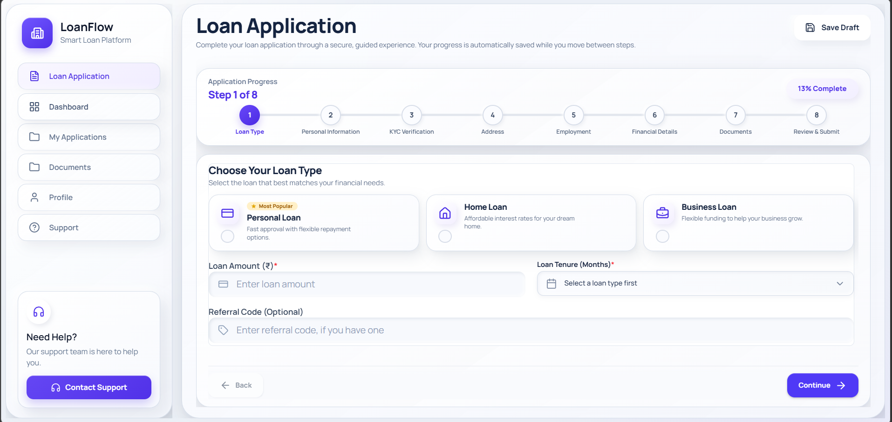

### Personal Information

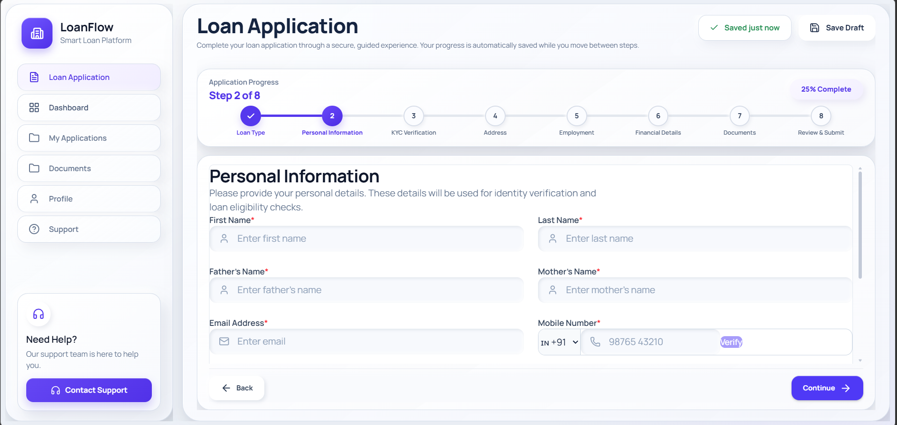

### KYC Verification

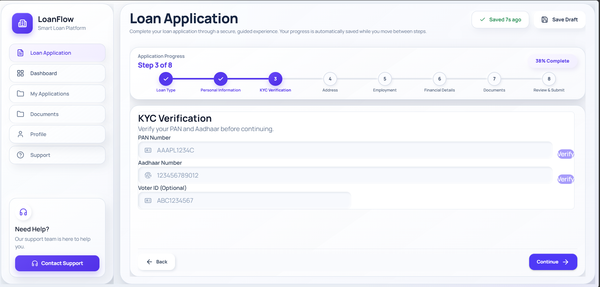

### Address Information

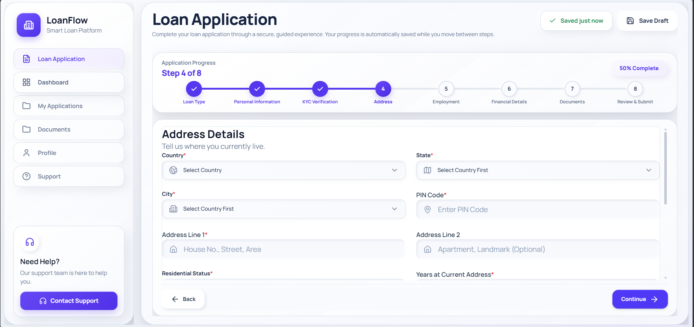

### Employment & Income

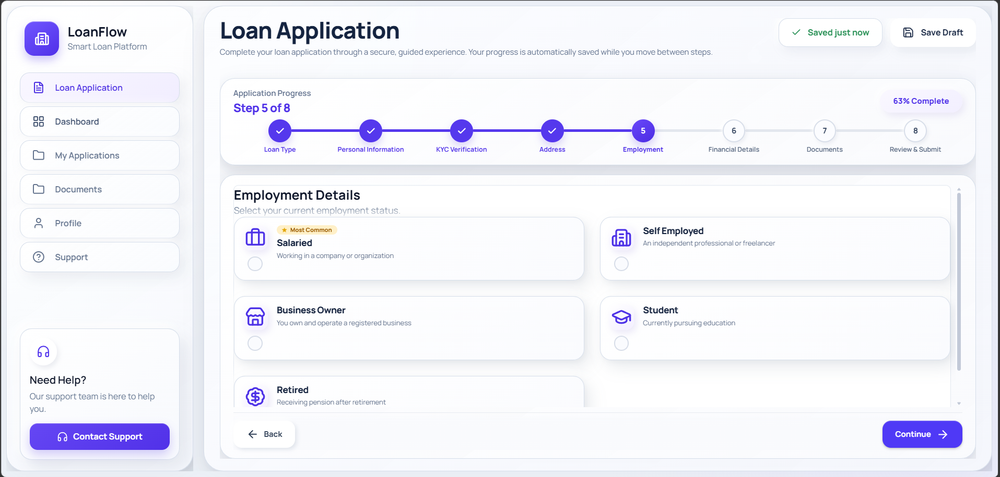

### Co-Applicant

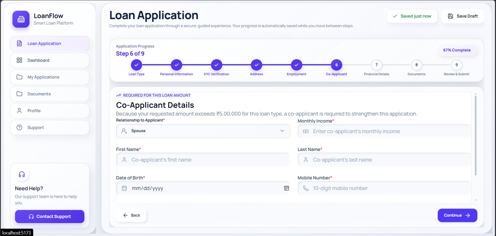

### Financial Details

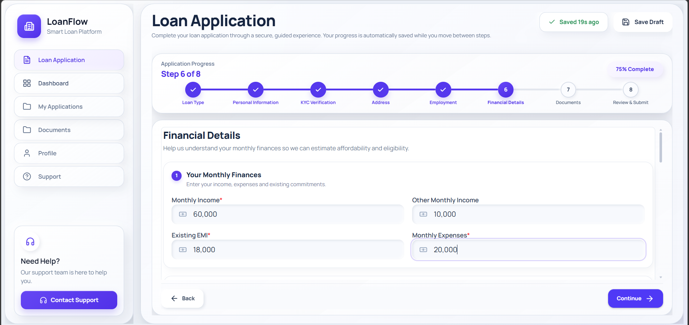
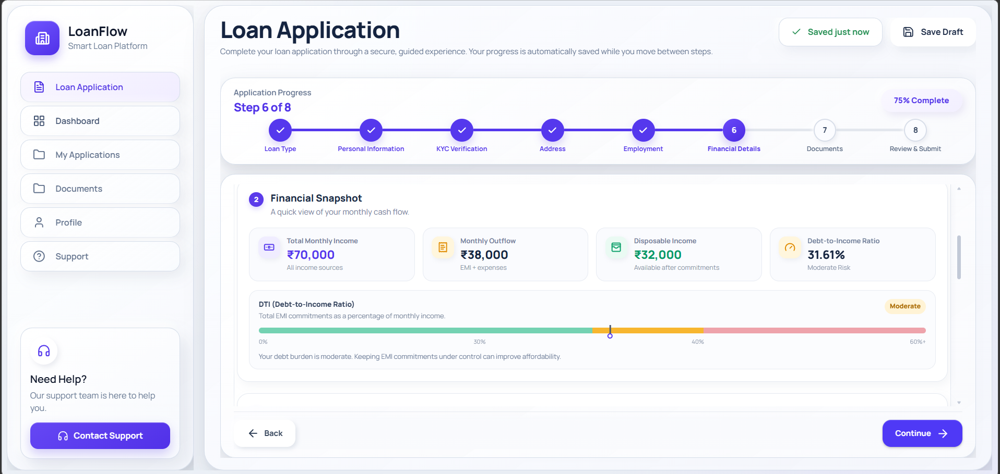
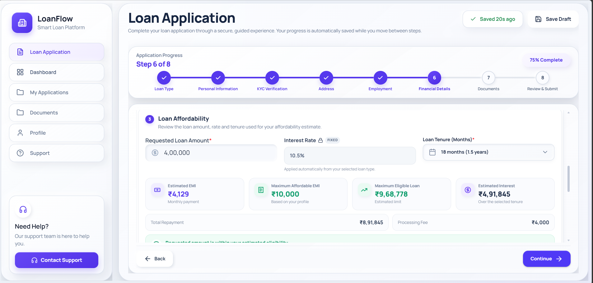
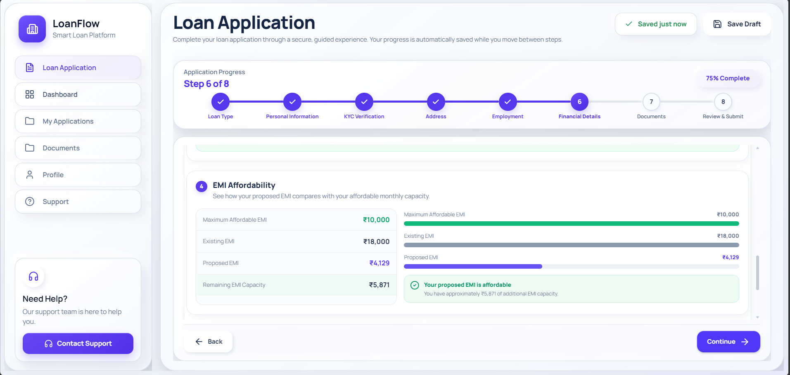
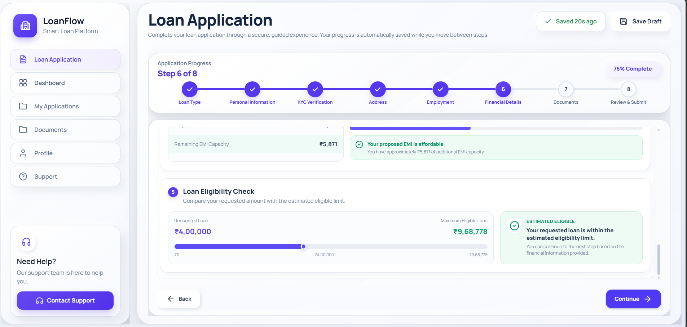

### Document Upload & E-Signature

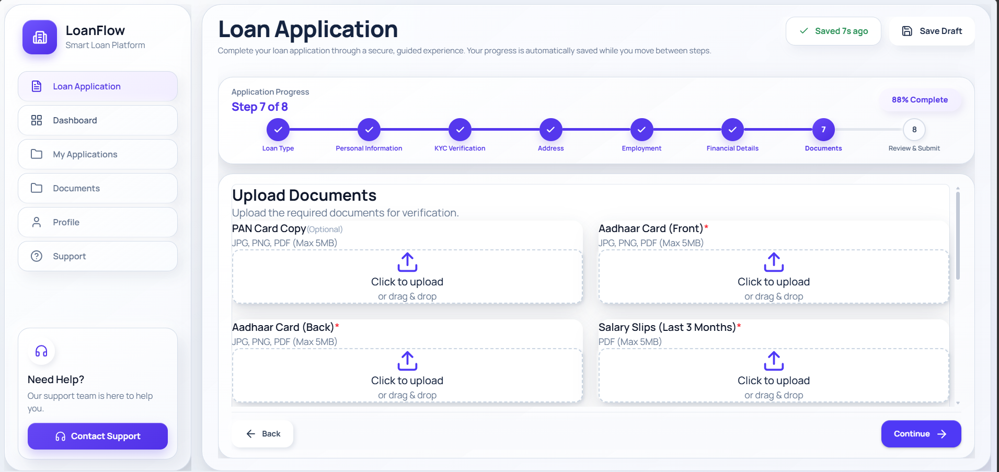
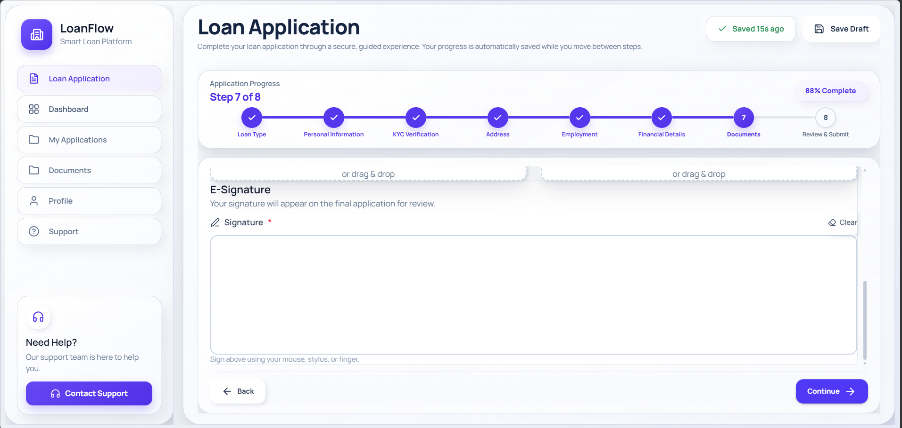

### Review & Submit

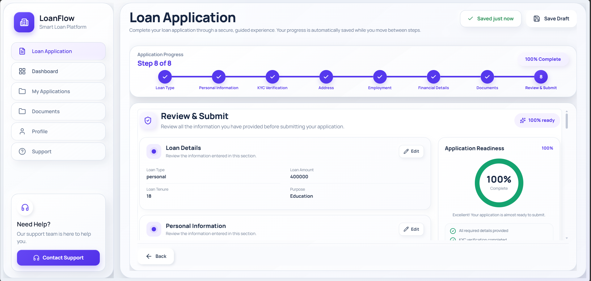
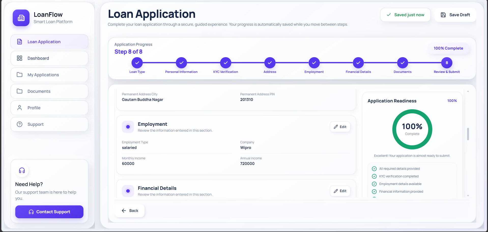
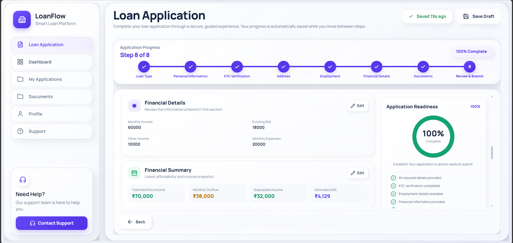
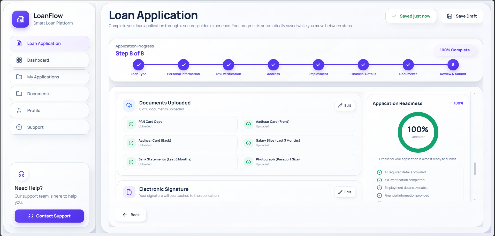
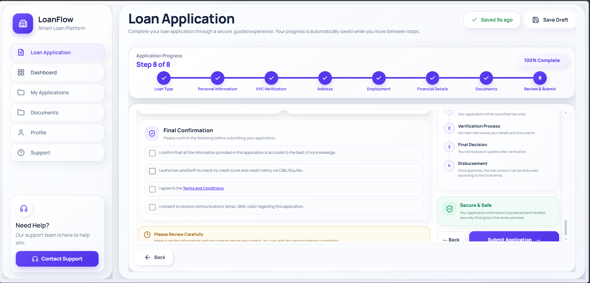

---

## 🎯 Application Flow

The application is organized as a wizard with **nine logical stages**:

1. **Loan Type**
   - Personal / Home / Business
   - Loan amount
   - Loan tenure
   - Loan purpose
   - Referral code
   - Home-loan-specific property details

2. **Personal Information**
   - Applicant name
   - Date of birth
   - Gender
   - Marital status
   - Parent details
   - Email
   - Mobile number

3. **KYC Verification**
   - PAN validation
   - Aadhaar validation
   - Optional identity documents
   - Verification state and consent

4. **Address**
   - Current address
   - PIN code
   - State and city
   - Residential status
   - Years at current address
   - Previous address when required
   - Permanent address
   - Same-as-current functionality

5. **Employment**
   - Employment type
   - Salaried details
   - Self-employed/business details
   - Company autocomplete
   - Income details
   - Business/GST information
   - Employment-specific conditional fields

6. **Co-Applicant**
   - Conditionally displayed
   - Relationship
   - Personal details
   - PAN
   - Income
   - Consent

7. **Financial Details**
   - Monthly income
   - Existing EMI
   - Other income
   - Monthly expenses
   - Requested amount
   - Interest rate
   - Tenure
   - Affordability/eligibility analysis

8. **Documents**
   - PAN document
   - Aadhaar documents
   - Salary slips / ITR
   - Bank statement
   - Property documents
   - Business registration
   - GST returns
   - Photograph
   - Electronic signature

9. **Review & Submit**
   - Section-by-section review
   - Financial summary
   - Key Fact Statement-style information
   - Compliance disclosures
   - Consent collection
   - Signature review
   - Final submission

---

## 🧠 Loan Rules

The application centralizes loan limits and interest rates so that validation and financial calculations use the same source of truth.

### Loan Amount & Tenure

| Loan Type | Minimum | Maximum | Tenure |
|---|---:|---:|---:|
| Personal | ₹50,000 | ₹10,00,000 | 12–60 months |
| Home | ₹50,000 | ₹1,00,00,000 | 60–360 months |
| Business | ₹50,000 | ₹50,00,000 | 12–120 months |

### Simulation Interest Rates

| Loan Type | Rate |
|---|---:|
| Personal | 10.5% p.a. |
| Home | 8.5% p.a. |
| Business | 14% p.a. |

### Co-Applicant Visibility

- **Home Loan:** co-applicant stage is always available.
- **Personal Loan:** appears when the requested amount exceeds **₹5,00,000**.
- **Business Loan:** appears when the requested amount exceeds **₹20,00,000**.

These rules are implemented in the wizard's visible-step navigation rather than simply moving through every numeric step.

---

## 🏗️ Architecture

The project uses a **wizard-based architecture** where each application stage owns its UI and validation schema while shared state is managed centrally.

```text
                    ┌──────────────────────┐
                    │   Loan Application   │
                    │       Wizard         │
                    └──────────┬───────────┘
                               │
          ┌────────────────────┼────────────────────┐
          │                    │                    │
          ▼                    ▼                    ▼
     Step Components       Validation           Shared State
     ───────────────       ──────────           ────────────
     Loan Type             Zod schemas           Zustand
     Personal Info         RHF resolver          formData
     KYC                    Field rules           verification
     Address                                      draft state
     Employment
     Co-Applicant
     Financial
     Documents
     Review
          │
          ▼
   Conditional Navigation
   ─────────────────────
   Loan type + amount
   Employment type
   Applicant profile
   Document requirements
          │
          ▼
    Review & Submission
```

### Why this architecture?

**Wizard pattern**
- Keeps the user focused on one stage at a time.
- Makes complex conditional flows easier to reason about.
- Allows step-specific validation and navigation.

**React Hook Form**
- Avoids unnecessary form-wide re-renders.
- Provides a strong API for large forms.
- Works naturally with schema resolvers.

**Zod**
- Keeps validation rules close to the data model.
- Makes conditional and field-level validation explicit.
- Works cleanly with React Hook Form.

**Zustand**
- Provides lightweight shared state for the multi-step workflow.
- Allows navigation and form data to remain available across step components.

---

## 🧩 Key Engineering Features

### 1. Conditional Step Navigation

The wizard does not blindly navigate from step `n` to `n + 1`.

Instead, visible steps are calculated from current application data. This is important for conditional stages such as the co-applicant flow.

```text
Loan Type
    ↓
Personal Information
    ↓
KYC
    ↓
Address
    ↓
Employment
    ↓
[Co-Applicant — conditional]
    ↓
Financial Details
    ↓
Documents
    ↓
Review & Submit
```

### 2. Schema-Based Validation

Validation schemas are separated by domain:

```text
src/schemas/
├── address.schema.js
├── coApplicant.schema.js
├── documents.schema.js
├── employment.schema.js
├── financial.schema.js
├── kyc.schema.js
├── loanType.schema.js
└── personalInfo.schema.js
```

This keeps the validation layer maintainable as the application grows.

### 3. PAN & Aadhaar Validation

The project includes:

- PAN format validation
- PAN entity-type validation
- Aadhaar 12-digit validation
- Verhoeff checksum utility
- Verification state management
- Masking utilities for sensitive values

### 4. Financial Calculations

The financial section provides:

- Monthly income
- Existing EMI
- Other income
- Monthly expenses
- Requested loan amount
- Interest rate
- Tenure
- Affordability analysis
- Eligibility feedback

### 5. Document Upload

The document flow supports different requirements depending on the application context.

Examples include:

- Identity documents
- Salary slips
- ITR
- Bank statements
- Property documents
- Business registration
- GST returns
- Photograph

The codebase also contains utilities for client-side image compression.

### 6. E-Signature

The document stage includes a signature-pad component that supports:

- Mouse input
- Touch input
- Clearing the signature
- Capturing the signature
- Using the captured signature during review

### 7. Draft Persistence

The project includes a browser-storage draft system designed around:

```text
Form State
   ↓
Serialize
   ↓
Secure/Encoded Storage
   ↓
Resume Detection
   ↓
Restore Draft
   ↓
Continue Application
```

This helps prevent users from losing partially completed applications.

---

## 🛠️ Tech Stack

### Frontend

- **React 19**
- **React Router**
- **Vite**
- **JavaScript / JSX**

### Form & Validation

- **React Hook Form**
- **Zod**
- **@hookform/resolvers**

### State Management

- **Zustand**

### UI & UX

- **Tailwind CSS**
- **Framer Motion**
- **Lucide React**
- **React Hot Toast**

### Documents & Signature

- **React Dropzone**
- **React Signature Canvas**
- Canvas-based image processing utilities

### Testing

- **Vitest**
- **Testing Library**
- **Playwright**

### Utilities

- **Axios**
- **Day.js**
- **UUID**
- **Country-State-City**

---

## 📁 Project Structure

```text
loan-application/
│
├── e2e/
│   ├── co-applicant-boundary.spec.js
│   └── step1-validation-and-rapid-clicks.spec.js
│
├── public/
│
├── src/
│   ├── app/
│   ├── assets/
│   ├── constants/
│   ├── features/
│   ├── hooks/
│   ├── layouts/
│   ├── pages/
│   ├── routes/
│   ├── schemas/
│   ├── steps/
│   │   ├── Step1LoanType/
│   │   ├── Step2PersonalInfo/
│   │   ├── Step3KYC/
│   │   ├── Step4Address/
│   │   ├── Step5Employment/
│   │   ├── Step6CoApplicant/
│   │   ├── Step6Financial/
│   │   ├── Step7Documents/
│   │   └── Step8Review/
│   ├── store/
│   ├── styles/
│   ├── test/
│   └── utils/
│
├── index.html
├── package.json
├── eslint.config.js
└── README.md
```

---

## 🚀 Getting Started

### Prerequisites

Make sure you have:

- Node.js installed
- npm installed
- Git installed

Check your versions:

```bash
node --version
npm --version
```

### 1. Clone the repository

```bash
git clone <YOUR_GITHUB_REPOSITORY_URL>
cd loan-application
```

### 2. Install dependencies

```bash
npm install
```

### 3. Start the development server

```bash
npm run dev
```

Vite will provide a local development URL, normally similar to:

```text
http://localhost:5173
```

### 4. Create a production build

```bash
npm run build
```

### 5. Preview the production build

```bash
npm run preview
```

---

## 🧪 Testing

### Run unit/component tests

```bash
npm test
```

### Run tests in watch mode

```bash
npm run test:watch
```

### Run Playwright E2E tests

```bash
npm run test:e2e
```

### Run ESLint

```bash
npm run lint
```

### Recommended final verification

```bash
npm run lint
npm test
npm run build
npm run test:e2e
```

### Even better for your submission

Because you're submitting to Zetheta today, I'd make the wording a little more professional:

```markdown
### Test Status

The project includes unit and component tests covering validation, financial calculations, draft storage, image compression, and core application utilities. A small number of test-environment issues remain under investigation.

---

## 🔍 Important Test Scenarios

The E2E suite is intended to cover critical user journeys such as:

- Personal loan happy path
- Home loan happy path
- Business loan happy path
- Empty-step validation
- Rapid navigation
- Co-applicant boundary conditions
- Conditional step visibility
- Form-state preservation
- Document upload behavior
- E-signature flow
- Review and submission behavior

The project brief calls for at least **15 distinct E2E user journeys**, including happy paths, validation errors, auto-save/resume, document upload, e-signature, keyboard navigation, and deliberate stress/break attempts.

---

## ♿ Accessibility

Accessibility is treated as a core part of the form experience.

The project targets:

- Proper labels for form controls
- Keyboard navigation
- Accessible error messaging
- ARIA attributes where required
- Visible focus states
- Responsive touch targets
- Mobile-friendly layouts
- Screen-reader-friendly progress/navigation information

Target viewport coverage includes mobile through large desktop layouts.

---

## 🔐 Security & Privacy Notes

This project is a **frontend simulation** and should not be treated as a production lending system.

The codebase includes frontend-oriented protections/utilities for:

- PII masking
- Secure draft-storage handling
- Client-side validation
- Sensitive-value display controls
- Avoiding unnecessary exposure of financial information

For a real lending product, sensitive information must be handled by a properly secured backend, with server-side validation, authenticated sessions, secure key management, audit logging, regulatory controls, and approved third-party verification providers.

**Never use real PAN, Aadhaar, banking credentials, or other sensitive financial information while demonstrating this project.**

---

## 📊 Project Goals

The original project brief defines ambitious quality targets around:

- Higher application completion
- Faster completion time
- Better mobile completion
- Draft recovery
- Accessibility
- Lower validation errors
- Lower document-upload failure
- Automated E2E coverage

The implementation is therefore designed as more than a visual form: it demonstrates **state management, validation architecture, conditional business logic, UX engineering, testing, and frontend reliability**.

---

## 🌐 Deployment

The application is compatible with modern static frontend hosting platforms.

Suggested deployment options:

- Vercel
- Netlify
- Cloudflare Pages
- GitHub Pages with an appropriate SPA configuration

After deployment, add the live URL here:

```text
Live Demo: <YOUR_DEPLOYED_URL>
```

---

## 📝 Architecture Documentation

For a larger submission, consider maintaining a separate:

```text
ARCHITECTURE.md
```

Recommended sections:

- Wizard architecture
- State-management strategy
- Validation architecture
- Conditional-step logic
- Draft persistence
- Document-upload lifecycle
- Financial calculation flow
- E-signature lifecycle
- Testing strategy
- Accessibility strategy

---

## ⚠️ Known Limitations

- PAN/Aadhaar verification is simulated.
- There is no real lender backend in this repository.
- Credit-bureau verification is not connected to CIBIL/Equifax.
- Loan approval is simulated and should not be interpreted as a real lending decision.
- Document processing is frontend-only.
- Production deployment requires backend/API security controls.
- Screenshot files are intentionally kept outside the source archive; add the captured application screenshots under `docs/screenshots/`.

---

## 🎓 Project Context

This project was developed as a frontend engineering implementation of a complex digital lending form brief.

The supplied project brief emphasizes:

- 8+ application steps
- 50+ fields
- Conditional rendering
- Cross-step validation dependencies
- Auto-save and resume
- Document upload and compression
- E-signature capture
- Pre-approval summary
- E2E testing
- WCAG-oriented accessibility
- Responsive behavior

The README structure follows those submission expectations while documenting the implementation found in this repository.

---

## 👨‍💻 Author

**Raj Sharma**


---

## 📄 License

Add the license that applies to your repository, for example:

```text
MIT License
```

If this project is being submitted as an assessment, follow the submission and ownership requirements provided by the project organizer.
